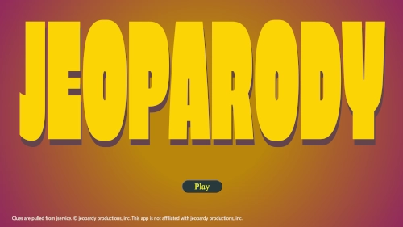

# [`Jeoparody`](https://jeoparody.projekjv.dev/)

 A mock of jeopardy game I remade with Create React App from my older Jquery app

## Jservice 

Uses [jservice](https://jservice.io/) API for geenrating clues.

## Wish List
<ul>
    <li>Multiplayer option</li>
    <li>Stats/Leaderboard</li>
    <li>Animations</li>
    <li>Answer via Voice</li>
    <li>Difficulty options</li>

</ul>